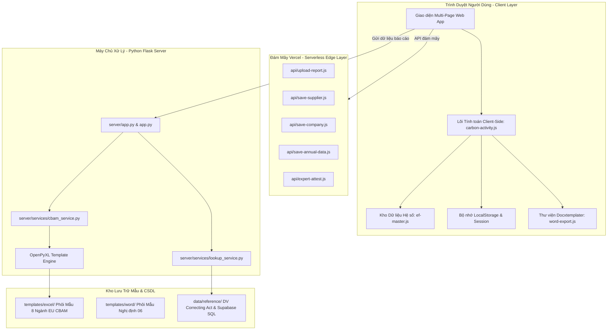

# 🏗️ Kiến Trúc Hệ Thống (System Architecture)

> Tài liệu mô tả kiến trúc kỹ thuật của nền tảng **GreenShift**.

---

## 1. Sơ Đồ Tổng Thể Hệ Thống

---

## 2. Các Phân Hệ Tính Toán Chính (Core Engines)

### 2.1. Phân hệ Tính toán Phát thải Nội địa (Scope 1 - 2 - 3)
- **Vị trí file**: `assets/js/carbon-activity.js`, `assets/js/ef-master.js`, `assets/js/ipcc-data.js`.
- **Cơ chế**:
  - Không cần máy chủ backend để tính toán (Zero Server Round-trip).
  - Tự động tra cứu NCV (Net Calorific Value) và Emission Factors từ cơ sở dữ liệu Bộ TN&MT.
  - Phân loại phát thải theo đúng biểu mẫu phụ lục Thông tư 01/2022/TT-BTNMT và Nghị định 06/2022/NĐ-CP.

### 2.2. Phân hệ Báo cáo Thuế Carbon EU CBAM
- **Vị trí file**: `cbam-dashboard.html`, `server/services/cbam_service.py`, `templates/excel/`.
- **Cơ chế**:
  - Web client thu thập thông tin cơ sở, khối lượng sản xuất $AL$, điện năng tiêu thụ, nhiên liệu đốt, phát thải quy trình và tiền chất đã mua.
  - Client gửi JSON payload lên endpoint `/api/generate-report`.
  - Backend tự động chọn phôi tương ứng (`cement`, `steel`, `fertilizer`, `aluminum`, `hydrogen`), mở file phôi gốc bằng `openpyxl`, điền đúng các ô ô quy định tại sheet `A_InstData`, `B_EmInst`, `C_Goods`, `D_Processes`, giữ nguyên các macro và định dạng của Liên minh châu Âu, sau đó stream file nhị phân trả về cho người dùng tải xuống.

---

## 3. Quy Ước Đặt Tên & Cấu Trúc Mã Nguồn

| Thư mục | Mục đích | Quy tắc |
| :--- | :--- | :--- |
| `assets/css/` | Tệp định dạng CSS | Kebab-case, chuẩn hóa theo Design System |
| `assets/js/` | Mã logic JavaScript | Tách bạch giữa `core/` (tính toán) và `modules/` (tính năng) |
| `assets/images/` | Hình ảnh tĩnh | Viết thường, phân loại theo mục đích (`brand`, `team`, `blog`, `press`, `ui`) |
| `assets/vendor/` | Thư viện bên ngoài | Chỉ chứa các bản `.min.js` hoặc phông chữ cục bộ |
| `templates/` | Phôi báo cáo | Tách bạch `excel/` và `word/` |
| `data/` | CSDL tham chiếu | Chứa CSDL tĩnh cho hệ thống tra cứu |
| `server/` | Mã nguồn Flask | Kiến trúc Service Layer, không viết logic trực tiếp trong Route |
