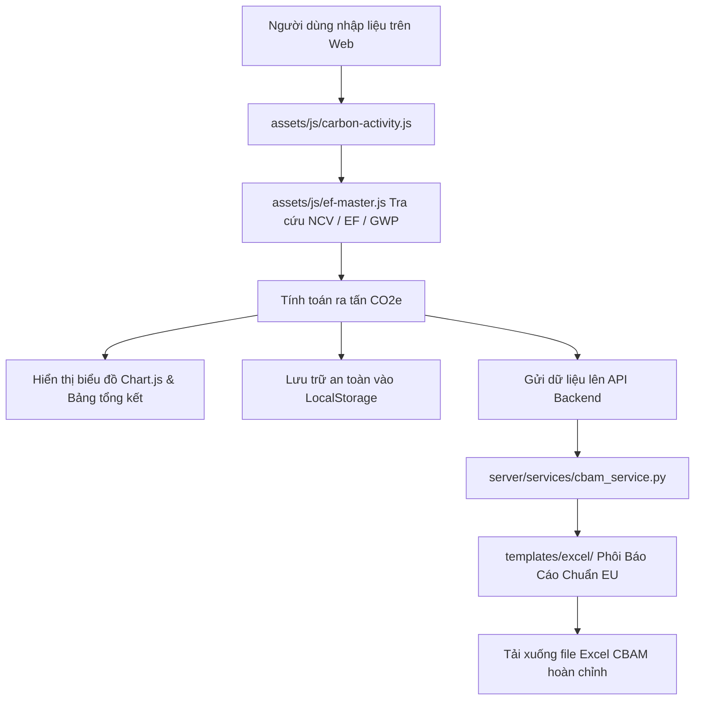

# 🚀 Hướng Dẫn Codebase & Bản Đồ Mã Nguồn (Developer Onboarding)

> **GreenShift** | Nền tảng Tự động hóa Báo cáo Khí Nhà Kính & Báo cáo Thuế Carbon EU CBAM cho Doanh nghiệp Việt Nam.

Tài liệu này giúp các lập trình viên mới nắm bắt nhanh toàn bộ cấu trúc dự án và luồng dữ liệu trong **5 phút**.

---

## 1. Cách Chạy Dự Án Cục Bộ (Trong 1 Phút)

### Cách 1: Chạy Frontend nhanh qua VS Code Live Server
1. Mở thư mục dự án trong VS Code hoặc Cursor IDE.
2. Chuột phải vào file `index.html` (hoặc `carbon-inventory.html`, `cbam-dashboard.html`).
3. Chọn **"Open with Live Server"** (Cổng mặc định: `http://127.0.0.1:5501`).
4. Giao diện chạy độc lập, tính toán 100% phía Client-Side và lưu trữ qua LocalStorage.

### Cách 2: Chạy đầy đủ cả Backend Server (Python Flask)
1. Cài đặt các thư viện phụ thuộc:
   ```bash
   pip install -r requirements.txt
   ```
2. Khởi chạy server:
   ```bash
   python app.py
   ```
3. Truy cập vào: `http://localhost:5000`

---

## 2. Bản Đồ Các Thành Phần Cốt Lõi

### Nhóm 1: Giao Diện Người Dùng (Frontend Pages)
- **[index.html](file:///index.html)**: Cổng chào / Landing Page giới thiệu giải pháp ESG và hệ sinh thái GreenShift.
- **[login.html](file:///login.html)**: Cổng đăng nhập tập trung (tài khoản demo: `greenshiftacl2026` / `1234`).
- **[carbon-inventory.html](file:///carbon-inventory.html)** (*Trụ cột 1 - Kiểm kê KNK nội địa*):
  - Quản lý danh mục thiết bị (máy phát điện, lò hơi, hệ thống điều hòa).
  - Bảng nhập liệu hoạt động (nhiên liệu, điện, rò rỉ gas máy lạnh).
  - Tự động xuất báo cáo Word (chuẩn Nghị định 06/2022/NĐ-CP).
- **[cbam-dashboard.html](file:///cbam-dashboard.html)** (*Trụ cột 2 - Thuế Carbon EU CBAM*):
  - Khai báo cơ sở và phân loại 6 ngành xuất khẩu (Thép, Xi măng, Nhôm, Phân bón, Hydrogen, Điện).
  - Thu thập dữ liệu phát thải trực tiếp, gián tiếp và đối soát tiền chất (Precursors).
  - Tự động điền phôi Excel chính thức của Ủy ban châu Âu (EC).
- **[setup.html](file:///setup.html)**: Thiết lập thông tin doanh nghiệp và quản lý đa chi nhánh/nhà máy.
- **[supplier.html](file:///supplier.html)**: Cổng Portal khảo sát Scope 3 dành cho chuỗi cung ứng.

### Nhóm 2: Bộ Não Tính Toán & CSDL Hệ Số (JavaScript Engine)
Nằm trong thư mục `assets/js/`:
- **`assets/js/carbon-activity.js`** *(Trái tim tính toán)*:
  Chứa toàn bộ thuật toán quy đổi toán học:
  - Đốt nhiên liệu: $\text{Khối lượng} \times \text{NCV} \rightarrow \text{Năng lượng TJ} \times \text{EF} \rightarrow \text{tCO}_2\text{e}$
  - Tiêu thụ điện lưới: $\text{kWh} \times \text{Hệ số lưới điện VN} \rightarrow \text{tCO}_2\text{e}$
  - Rò rỉ môi chất lạnh: $\text{kg gas} \times \text{Chỉ số GWP} \rightarrow \text{tCO}_2\text{e}$
- **`assets/js/ef-master.js`** *(Từ điển hệ số phát thải)*:
  Chứa hơn 25 loại nhiên liệu chuẩn hóa theo Bộ TN&MT và hơn 30 loại gas máy lạnh theo IPCC AR5/AR6.
- **`assets/js/word-export.js`**: Xuất bản báo cáo Word tự động phía client sử dụng thư viện Docxtemplater.

### Nhóm 3: Backend & Phôi Báo Cáo
- **`server/app.py`** & **`app.py`**: Khởi chạy API server và điều phối yêu cầu.
- **`server/services/cbam_service.py`**: Engine xử lý điền tự động dữ liệu vào các ô sheet chính xác trong phôi Excel EU CBAM (sử dụng OpenPyXL).
- **`server/services/lookup_service.py`**: Tra cứu hệ số mặc định của EU theo mã CN Code từ CSDL `data/reference/DV correcting act...`.
- **`templates/excel/`**: 8 phôi Excel chuẩn EU CBAM.
- **`templates/word/`**: Phôi báo cáo kiểm kê KNK theo Nghị định 06.

---

## 3. Luồng Dữ Liệu Hoạt Động (Data Flow)



---

## 4. Cấu Trúc Thư Mục Chuẩn Hóa
```
GreenShift/
├── assets/          # CSS, JS, Images, Vendor libs
├── api/             # Vercel Serverless Functions
├── data/            # CSDL tham chiếu & SME Toolkits
├── docs/            # Tài liệu kỹ thuật
├── server/          # Backend Flask (Routes & Services)
├── templates/       # Phôi mẫu Excel & Word
├── tests/           # Kịch bản kiểm thử tự động
└── *.html           # Các trang web và cổng ứng dụng
```
